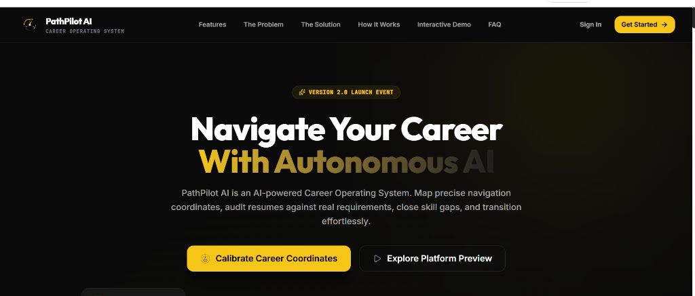
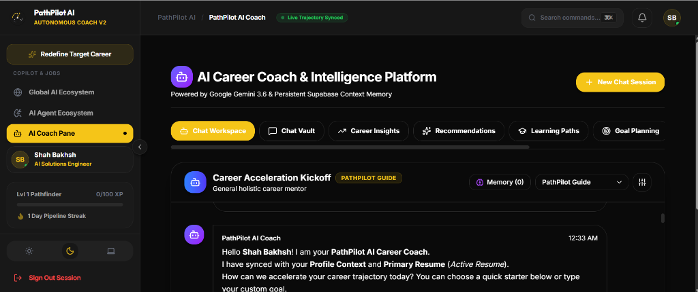
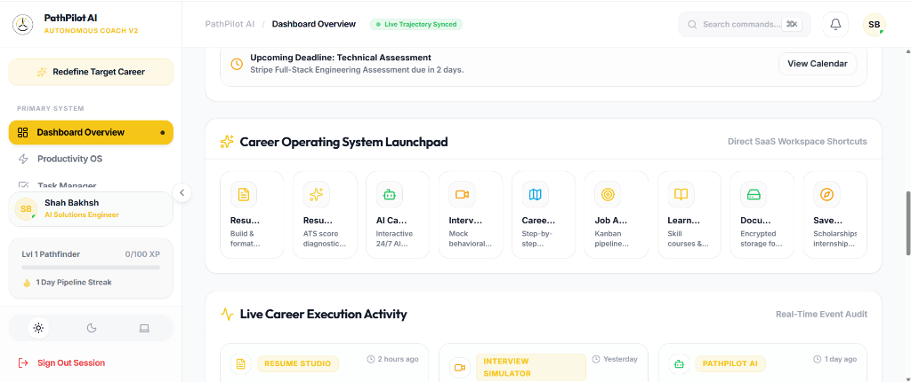
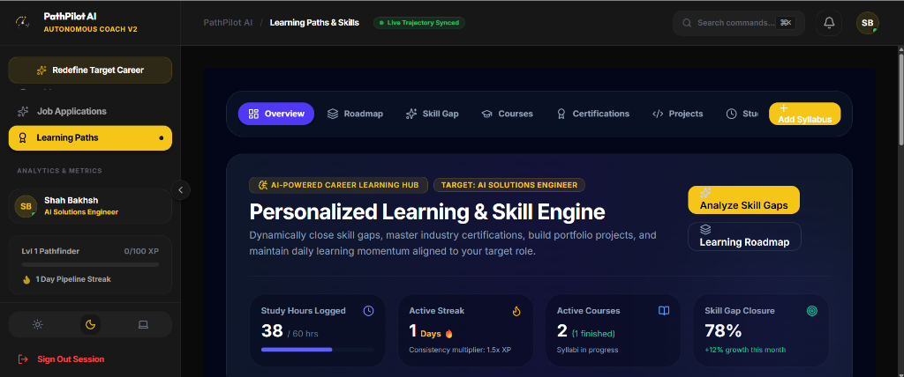
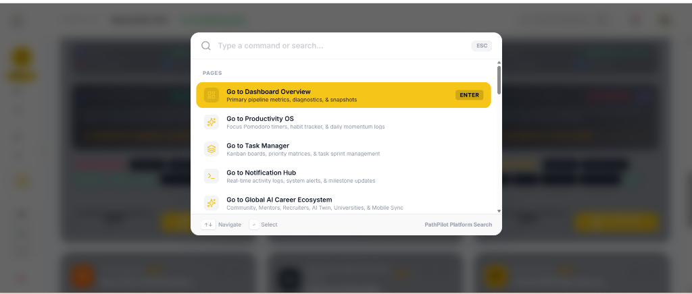
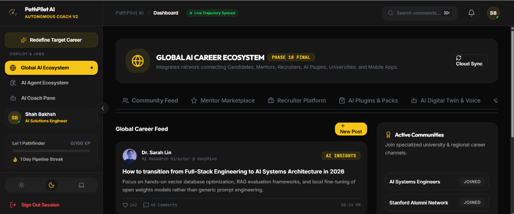
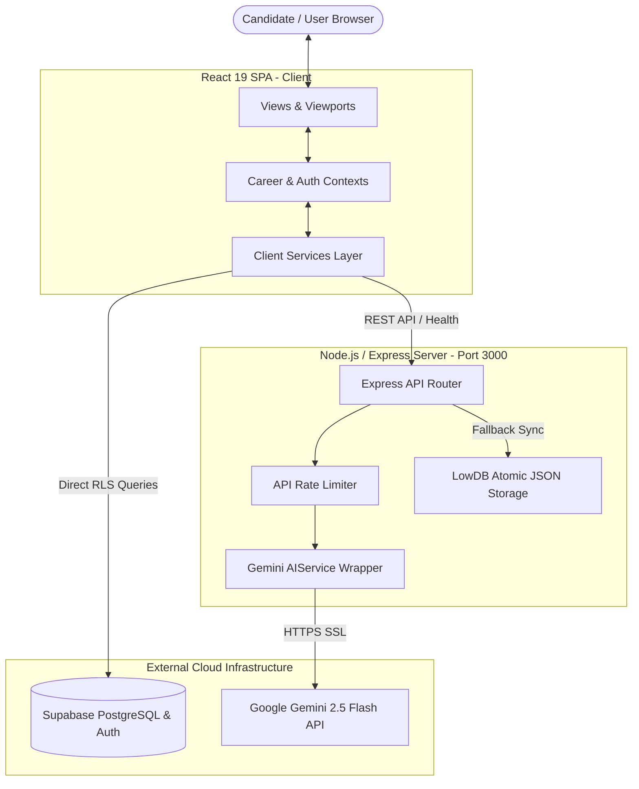
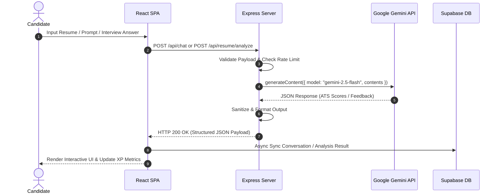

<div align="center">

  

  # PathPilot AI
  ### The Autonomous AI Career Operating System

  <p align="center">
    <b>An enterprise-grade, full-stack AI career navigation platform designed to guide professionals continuously along their career journeys like Google Maps.</b>
  </p>

  <p align="center">
    <a href="https://github.com/shahbakhsh/pathpilot-ai/actions"></a>
    <a href="https://pathpilot-ai-rust-phi.vercel.app"></a>
    <a href="https://react.dev"></a>
    <a href="https://typescriptlang.org"></a>
    <a href="https://vite.dev"></a>
    <a href="https://expressjs.com"></a>
    <a href="https://supabase.com"></a>
    <a href="https://aistudio.google.com"></a>
    <a href="./LICENSE"></a>
  </p>

  <p align="center">
    <a href="https://pathpilot-ai-rust-phi.vercel.app"><b>🚀 Try Live Demo</b></a> •
    <a href="./docs/ARCHITECTURE.md"><b>📖 Architecture Docs</b></a> •
    <a href="./docs/API_DOCUMENTATION.md"><b>📡 API Reference</b></a> •
    <a href="./docs/DEPLOYMENT.md"><b>☁️ Deployment Guide</b></a>
  </p>

  <br />
  

</div>

---

## 📋 Table of Contents

- [1. About PathPilot AI](#-1-about-pathpilot-ai)
  - [The Problem](#the-problem)
  - [The Solution](#the-solution)
  - [Target Audience](#target-audience)
  - [Vision](#vision)
- [2. Platform Features](#-2-platform-features)
- [3. AI Engine & Gemini Capabilities](#-3-ai-engine--gemini-capabilities)
  - [Model & Prompt Orchestration](#model--prompt-orchestration)
  - [Multi-Persona Mentorship](#multi-persona-mentorship)
  - [Context Injection & Memory](#context-injection--memory)
  - [Safety & Guardrails](#safety--guardrails)
- [4. Visual Interface & Screenshots](#-4-visual-interface--screenshots)
- [5. Technology Stack](#-5-technology-stack)
- [6. System Architecture](#-6-system-architecture)
  - [High-Level Architecture Diagram](#high-level-architecture-diagram)
  - [AI Request Sequence Diagram](#ai-request-sequence-diagram)
- [7. Repository & Directory Structure](#-7-repository--directory-structure)
- [8. Installation & Quick Start](#-8-installation--quick-start)
- [9. Environment Variables](#-9-environment-variables)
- [10. Database Schema & Supabase Infrastructure](#-10-database-schema--supabase-infrastructure)
- [11. Production Deployment](#-11-production-deployment)
- [12. Performance & Optimizations](#-12-performance--optimizations)
- [13. Security & Data Protection](#-13-security--data-protection)
- [14. Standout Innovations](#-14-standout-innovations)
- [15. Future Roadmap](#-15-future-roadmap)
- [16. Contributing](#-16-contributing)
- [17. License](#-17-license)
- [18. Author & Contact](#-18-author--contact)
- [19. Acknowledgements](#-19-acknowledgements)

---

## 💡 1. About PathPilot AI

### The Problem
Navigating a modern professional career is fragmented, overwhelming, and non-linear. Job seekers and professionals face:
- **Black-box Applicant Tracking Systems (ATS)** that silently discard resume applications without actionable feedback.
- **Generic career advice** that lacks hyper-personalized context regarding a candidate's actual skill gap, experience, or timeline.
- **Unstructured interview prep**, leading to performance anxiety during real technical and behavioral interviews.
- **Fragmented tools** — separate apps for job tracking, resume building, learning, and daily productivity resulting in context switching and lost momentum.

### The Solution
**PathPilot AI** acts as a dynamic **Career Operating System**. Like Google Maps recalculating a route when traffic builds up, PathPilot AI dynamically evaluates a candidate's current skills, resume quality, interview readiness, and job market target. It continuously plots a 3-phase actionable roadmap, simulates technical/behavioral interviews in real-time, diagnoses resume ATS compatibility, and manages daily execution.

### Target Audience
- **Software Engineers & Technical Candidates** preparing for tech roles, internships, or promotions.
- **Career Switchers** needing step-by-step skill gap bridges.
- **Students & Graduates** building professional resumes, portfolios, and job search pipelines.
- **Tech Recruiters & Mentors** monitoring candidate progress and career telemetry.

### Vision
To empower candidates globally with autonomous, enterprise-grade AI mentorship — equalizing access to high-tier career guidance, interview preparation, and job market opportunities.

---

## ⚡ 2. Platform Features

| Feature Category | Description & Capabilities |
| :--- | :--- |
| **🔐 Authentication & RBAC** | Supabase Auth integration supporting Email/Password, OAuth, guest sandbox mode, and strict Row-Level Security (RLS). |
| **👤 Profile & Gamification** | Interactive profile management, headline/bio customizer, experience points (XP), daily streaks, level tiers, and achievement badges. |
| **📄 ATS Resume Analyzer** | Structural & keyword ATS diagnostic engine that extracts text, evaluates match percentages (0–100%), highlights missing keywords, and generates actionable improvements. |
| **📝 Interactive Resume Builder** | Real-time multi-template resume editor supporting section reordering, bullet point enhancements, version control, and multi-format exports. |
| **🤖 AI Career Mentor** | Real-time conversational AI coach powered by Google Gemini with multi-persona selection (Encouraging, Direct, Interviewer, Executive). |
| **🗺️ Dynamic Career Roadmaps** | 3-phase adaptive milestones generated by AI based on target role, experience level, and timeline, with milestone checking and progress calculation. |
| **🎙️ AI Interview Simulator** | Custom mock interview simulator generating targeted technical/behavioral questions, recording candidate answers, and scoring clarity, technical depth, and STAR alignment. |
| **📚 Skill & Learning Hub** | Curated skill recommendation engine, learning path tracker, course logging, and weekly study schedule planner. |
| **🎯 Opportunity Search** | Integrated job, internship, and scholarship discovery engine matching user skills with market demand. |
| **📊 Kanban Application Tracker** | Visual pipeline tracking job applications across `Wishlist`, `Applied`, `Interviewing`, `Offer`, and `Rejected` columns with interview dates and salary metrics. |
| **⚡ Productivity & Missions** | Task management workspace with daily/weekly missions, calendar event syncing, focus timers, and execution telemetry. |
| **📁 Document Vault** | Encrypted document repository for resumes, cover letters, certificates, and portfolio attachments. |
| **🔔 Notification Center** | Centralized in-app alerts for application status changes, daily streak reminders, and AI coach recommendations. |
| **⚙️ Preferences & Theme System** | Full Dark Mode and Light Mode support with customized accent themes, notification triggers, and privacy controls. |

---

## 🤖 3. AI Engine & Gemini Capabilities

PathPilot AI integrates the **Google GenAI SDK (`@google/genai` v2.4.0)** with **Google Gemini 2.5 Flash** models running server-side on Express to deliver high-speed, structured intelligence.

```
[ User Prompt ] ──► [ Express Server Proxy ] ──► [ Rate Limiter & Sanitizer ] ──► [ Gemini 2.5 Flash ] ──► [ Structured Response ]
```

### Model & Prompt Orchestration
- **Server-Side API Proxy**: The `GEMINI_API_KEY` is maintained strictly on the backend (`server.ts`) and is never exposed in client bundles.
- **Automatic Fallback & Retry**: Implements an exponential backoff retry loop (`maxRetries = 3`) with `AbortController` timeout protection (30s max).
- **Structured JSON Mode**: Enforces `responseMimeType: "application/json"` with schema enforcement for structured ATS scores, interview questions, and roadmaps.

### Multi-Persona Mentorship
Candidates can toggle AI coach personas in real-time:
1. **Encouraging Coach**: Supportive, growth-mindset feedback focused on motivation and step-by-step progress.
2. **Direct Recruiter**: Concise, realistic, no-nonsense feedback mimicking silicon valley recruiters.
3. **Strict Interviewer**: High-rigor technical probing, challenging candidates on edge cases and system design.
4. **Executive Mentor**: Strategic advice focused on leadership, compensation negotiation, and long-term trajectory.

### Context Injection & Memory
- **Profile Awareness**: Automatically injects candidate target role, top skills, experience level, and active streak into AI system instructions.
- **Conversation Persistence**: Chat history is synchronized atomically with Supabase PostgreSQL `ai_conversations` and `ai_messages` tables.

### Safety & Guardrails
- **Prompt Sanitization**: Sanitizes input strings against prompt injection attempts before dispatching to Gemini models.
- **IP Rate Limiting**: Enterprise rate limiter (`APIKeyRateLimiter`) caps API requests to 500 req/min to protect against burst throttling.

---

### 1. 🚀 Platform Landing Page & Hero Banner
The high-converting SaaS landing page presenting the **Autonomous AI Career Operating System** vision, interactive demo triggers, and feature navigation.


- **Launch Badge**: Highlights platform version status (`VERSION 2.0 LAUNCH EVENT`).
- **Call-to-Action Controls**: Direct triggers to **Calibrate Career Coordinates** and **Explore Platform Preview**.
- **Navigation Bar**: Quick links for **Features**, **The Problem**, **The Solution**, **How It Works**, **Interactive Demo**, **FAQ**, and **Authentication**.

---

### 2. 🤖 AI Career Coach & Intelligence Platform
The primary interactive AI workspace powered by **Google Gemini 2.5 Flash** with persistent context memory synced to Supabase PostgreSQL.



- **Live Trajectory Syncing**: Displays real-time sync status (`Live Trajectory Synced`) with current user profile context.
- **Multi-Tab Intelligence Suite**: Switch between **Chat Workspace**, **Chat Vault**, **Career Insights**, **Recommendations**, **Learning Paths**, and **Goal Planning**.
- **Multi-Persona Mentorship**: Toggle between **PathPilot Guide** (Encouraging), **Direct Recruiter**, **Strict Technical Interviewer**, and **Executive Mentor**.
- **Memory Vault**: Manages persistent candidate facts, goals, and technical stack preferences.

---

### 2. 🎯 Executive SaaS Launchpad & Dashboard Overview
Central command center providing immediate access to all core platform tools, active application streaks, and live execution activity.



- **Direct Workspace Shortcuts**: One-click launcher for **Resume Studio**, **ATS Diagnostic**, **AI Career Coach**, **Interview Simulator**, **Career Roadmap**, **Job Application Kanban**, **Learning Hub**, **Encrypted Vault**, and **Saved Opportunities**.
- **Real-Time Execution Activity**: Live event audit stream logging document updates, interview simulations, and AI recommendations.
- **Streak & XP Counter**: Tracks active daily pipeline streak (e.g. `1 Day Pipeline Streak`) and Pathfinder level progression.

---

### 3. 🎓 Personalized Learning & Skill Gap Engine
Adaptive learning workspace dynamically identifying skill gaps aligned with candidate target roles and plotting targeted syllabi.



- **Metric Cards**: Real-time tracking of **Study Hours Logged** (38/60 hrs), **Active Streak** with XP consistency multipliers (1.5x), **Active Courses** (2 courses in progress), and **Skill Gap Closure Rate** (+78%).
- **Interactive Workspaces**: Sub-tabs for **Roadmap**, **Skill Gap Analysis**, **Courses**, **Certifications**, **Projects**, and **Study Planner**.
- **One-Click Gap Diagnostics**: Instant `Analyze Skill Gaps` engine calculating market readiness for targeted engineering roles.

---

### 4. 🔍 Command Palette Search Overlay (`Cmd+K` / `Ctrl+K`)
Keyboard-first modal search overlay enabling instant navigation across the entire application viewport.



- **Instant Shortcuts**: Navigate to **Dashboard Overview**, **Productivity OS**, **Task Manager**, **Notification Hub**, and **Global AI Ecosystem**.
- **Keyboard Navigation**: Full arrow-key selection, `ENTER` execution, and `ESC` dismiss controls.

---

### 5. 🌐 Global AI Career Ecosystem
Integrated community network connecting candidates, industry mentors, recruiters, and AI digital twin systems.



- **Community Feed & Insights**: Real-time feed featuring posts from industry AI research leaders and engineering directors.
- **Ecosystem Tabs**: Navigation for **Community Feed**, **Mentor Marketplace**, **Recruiter Platform**, **AI Plugins & Packs**, and **AI Digital Twin & Voice**.
- **Active Community Channels**: Instant join channels for **AI Systems Engineers**, **Stanford Alumni Network**, and regional tech channels.

---

### Interface Matrix Summary

| Interface View | Key Capability | Primary Components |
| :--- | :--- | :--- |
| **🤖 AI Career Coach** | 24/7 Context-Aware Mentorship | `MentorView.tsx`, `aiCoachService.ts` |
| **🎯 SaaS Launchpad** | Direct Application Workspace Shortcuts | `DashboardView.tsx`, `dashboardService.ts` |
| **🎓 Skill Gap Engine** | Targeted Course & Syllabus Tracking | `LearningView.tsx`, `learningService.ts` |
| **🔍 Command Palette** | `Cmd+K` Keyboard-First Search Modal | `CommandPalette.tsx` |
| **🌐 Global Ecosystem** | Community & Recruiter Network | `EcosystemGlobalView.tsx`, `ecosystemService.ts` |
| **📄 ATS Resume Studio** | Match Score Radar & Skill Gap Diagnostic | `ResumeView.tsx`, `resumeService.ts` |
| **🎙️ Interview Simulator** | Mock Technical & Behavioral Sessions | `InterviewView.tsx`, `aiInterviewService.ts` |
| **📊 Application Kanban** | Drag-and-Drop Pipeline Tracking | `ApplicationsView.tsx`, `applicationService.ts` |

---

## 🛠️ 5. Technology Stack

### Frontend Architecture
| Technology | Version | Purpose |
| :--- | :--- | :--- |
| **React** | `v19.0.1` | Core User Interface Component Library |
| **TypeScript** | `v5.8.2` | Type-Safe Client & Server Development |
| **Vite** | `v6.4.3` | Next-Gen Lightning-Fast Frontend Build Tool |
| **Tailwind CSS** | `v4.1.14` | Utility-First Styling Engine with `@tailwindcss/vite` |
| **Motion** | `v12.23.24` | Smooth Micro-Animations & Page Transitions |
| **Lucide React** | `v0.546.0` | Modern SVG Icon Library |
| **Recharts** | `v3.9.2` | Dynamic Skill Radars & Analytics Visualizations |

### Backend & Infrastructure
| Technology | Version | Purpose |
| :--- | :--- | :--- |
| **Node.js** | `v20+` | Server Runtime Environment |
| **Express** | `v4.21.2` | Server API Routing & Static Asset Middleware |
| **Google GenAI SDK** | `v2.4.0` | Server-side Gemini 2.5 Flash Integration |
| **Supabase Client** | `v2.110.8` | PostgreSQL Database & Cloud Auth Gateway |
| **esbuild** | `v0.25.0` | Fast Server TypeScript Bundler (`server.cjs`) |
| **tsx** | `v4.21.0` | Hot-Reloading Server Development Runtime |

---

## 🏗️ 6. System Architecture

### High-Level Architecture Diagram



### AI Request Sequence Diagram



---

## 📁 7. Repository & Directory Structure

```
pathpilot-ai/
├── .github/                    # GitHub Workflows & PR Templates
├── docs/                       # Project Documentation Suite
│   ├── AI_SYSTEMS.md           # Prompt Engineering & Gemini AI Pipelines
│   ├── API_DOCUMENTATION.md    # Express REST API Reference
│   ├── ARCHITECTURE.md         # System Architecture & Technical Diagrams
│   ├── DATABASE_SCHEMA.md      # Database Entity Models & Specifications
│   ├── DEPLOYMENT.md           # Production Deployment Guide (Cloud Run, Docker, Vercel)
│   ├── DESIGN_SYSTEM.md        # UI/UX Token & Component Architecture
│   └── PRD.md                  # Product Requirement Specification
├── public/                     # Static Web Assets (Favicons, Icons)
├── src/                        # Frontend Source Code
│   ├── components/             # Reusable UI Components & Views
│   │   ├── layout/             # Sidebar, Header, Navigation
│   │   ├── ui/                 # Buttons, Cards, Modals, Badges
│   │   └── views/              # 27+ Page Views (Dashboard, Resume, Mentor, etc.)
│   ├── contexts/               # Global React State Providers
│   ├── hooks/                  # Custom React Hooks
│   ├── services/               # 36 Client Service Engines (AI, Supabase, Storage)
│   ├── types/                  # TypeScript Types & Interfaces
│   ├── index.css               # Global CSS Design Tokens & Utilities
│   └── main.tsx                # React Root Application Entry
├── server.ts                   # Express Backend & Gemini Proxy API
├── .env.example                # Environment Variable Template
├── .gitignore                  # Git Exclusion Rules (Secrets, Builds, SQL ignored)
├── Dockerfile                  # Production Multi-Stage Alpine Dockerfile
├── .dockerignore               # Docker Ignore Manifest
├── index.html                  # HTML5 SPA Document Root
├── package.json                # Project Dependencies & Scripts
├── tsconfig.json               # TypeScript Compiler Configuration
├── vercel.json                 # Vercel Deployment & Route Rewrites
└── vite.config.ts              # Vite Bundler & Manual Chunk Configuration
```

---

## ⚙️ 8. Installation & Quick Start

### Prerequisites
- **Node.js**: `v20.0.0` or higher
- **npm**: `v9.0.0` or higher

### Step 1: Clone Repository
```bash
git clone https://github.com/shahbakhsh/pathpilot-ai.git
cd pathpilot-ai
```

### Step 2: Install Dependencies
```bash
npm install
```

### Step 3: Configure Environment Variables
Copy the template file to `.env`:
```bash
cp .env.example .env
```

Edit `.env` and add your **Google Gemini API Key**:
```env
GEMINI_API_KEY="your_actual_gemini_api_key"
PORT=3000
NODE_ENV=development
```

### Step 4: Run Development Server
```bash
npm run dev
```
Open **[http://localhost:3000](http://localhost:3000)** in your browser.

### Step 5: Verify Production Build
```bash
npm run build
npm start
```

---

## 🔐 9. Environment Variables

The following matrix documents all environment variables supported by PathPilot AI. Secrets are **never** exposed in client bundles.

| Variable | Environment | Required | Description | Example Placeholder |
| :--- | :--- | :--- | :--- | :--- |
| `GEMINI_API_KEY` | Server | **Yes** | Google Gemini API Secret Key | `AIzaSy...` |
| `PORT` | Server | Optional | Server Port (Defaults to `3000`) | `3000` |
| `NODE_ENV` | Server | Optional | Environment Mode (`development`/`production`) | `production` |
| `VITE_SUPABASE_URL` | Client & Server | Optional | Supabase Project Endpoint | `https://ref.supabase.co` |
| `VITE_SUPABASE_ANON_KEY` | Client & Server | Optional | Supabase Public Anonymous API Key | `eyJhbG...` |
| `SUPABASE_SERVICE_ROLE_KEY` | Server Only | Optional | Supabase Service Role Key | `eyJhbG...` |

---

## 🗄️ 10. Database Schema & Supabase Infrastructure

PathPilot AI features a production PostgreSQL schema comprising **41 tables** with strict **Row-Level Security (RLS)** isolation:

```
[ auth.users ] (Supabase Auth)
      │
      ├───► [ public.profiles ] (1:1 User Profile & XP)
      │         │
      │         ├───► [ public.career_goals ] (1:N Goals)
      │         ├───► [ public.resumes ] (1:N Resumes)
      │         ├───► [ public.career_roadmaps ] (1:N Roadmaps)
      │         ├───► [ public.applications ] (1:N Applications)
      │         ├───► [ public.ai_conversations ] ───► [ public.ai_messages ] (1:N Chat History)
      │         ├───► [ public.interview_sessions ] (1:N Mock Interviews)
      │         └───► [ public.documents ] (1:N Storage Vault)
```

### Core Security Policy Standard (RLS)
All user-owned tables enforce fail-safe user isolation policies:
```sql
CREATE POLICY "Users manage their own data"
  ON public.applications FOR ALL
  USING (auth.uid() = user_id);
```

> Detailed database specifications can be found in [`docs/DATABASE_SCHEMA.md`](./docs/DATABASE_SCHEMA.md). Note that actual `.sql` schema files are explicitly excluded from Git for repository security.

---

## ☁️ 11. Production Deployment

### Deployment to Vercel (Recommended)
PathPilot AI is deployed live at **[https://pathpilot-ai-rust-phi.vercel.app](https://pathpilot-ai-rust-phi.vercel.app)** and pre-configured for seamless deployment to **Vercel** via [`vercel.json`](./vercel.json):
1. Push your repository to GitHub.
2. Import the repository into [Vercel](https://vercel.com).
3. Set the environment variable `GEMINI_API_KEY` in the Vercel Dashboard.
4. Click **Deploy**. Vercel will automatically build the client SPA and route backend endpoints via `@vercel/node`.

### Containerized Deployment (Docker / Google Cloud Run)
PathPilot AI includes a production multi-stage Alpine [`Dockerfile`](./Dockerfile):

```bash
# 1. Build Container Image
docker build -t pathpilot-ai:v1.0.0 .

# 2. Run Container Locally
docker run -d -p 3000:3000 -e GEMINI_API_KEY="YOUR_KEY" pathpilot-ai:v1.0.0
```

> Full deployment steps for Cloud Run, Render, and AWS can be found in [`docs/DEPLOYMENT.md`](./docs/DEPLOYMENT.md).

---

## 🚀 12. Performance & Optimizations

- **Vite Code Splitting**: Custom `manualChunks` in [`vite.config.ts`](./vite.config.ts) breaks vendor libraries into specialized chunks (`vendor-core`, `vendor-charts`, `vendor-supabase`, `vendor-icons`), reducing initial bundle sizes.
- **Dynamic View Lazy Loading**: Page views are loaded dynamically on demand, reducing main-thread parse time.
- **Local Fallback Persistence**: `server.ts` includes an atomic JSON file storage mechanism in `data/db.json` with temporary file renaming to prevent data corruption during unexpected restarts.
- **Dynamic Port Allocation**: `server.ts` automatically adapts to `process.env.PORT` for zero-configuration compatibility across cloud PaaS providers.

---

## 🔒 13. Security & Data Protection

- **API Secret Isolation**: `GEMINI_API_KEY` is maintained exclusively in server environment variables. Client requests proxy through Express `/api/*` endpoints.
- **Supabase Row-Level Security (RLS)**: Users can only access their own records. RLS policies block cross-tenant data leaks.
- **Input Validation Guardrails**: Client-side UUID regex validation (`isValidUUID`) sanitizes database queries before execution, preventing malformed PostgreSQL syntax errors.
- **Security Headers**: Production builds inject `X-Content-Type-Options`, `X-Frame-Options`, and `Referrer-Policy` headers.

---

## ⭐ 14. Standout Innovations

1. **Google Maps-Style Career Rerouting**: Unlike static career blogs, PathPilot AI dynamically adjusts target roadmaps when a candidate completes a skill or changes target roles.
2. **Real-time STAR Interview Diagnoser**: Evaluates mock interview transcripts in real-time, breaking down candidate answers into *Situation*, *Task*, *Action*, and *Result* scores.
3. **Zero-Lockin Sandbox Mode**: Enables immediate sandbox experimentation with local data persistence before connecting to Supabase cloud auth.

---

## 📅 15. Future Roadmap

- [x] Server-Side Gemini 2.5 Flash API Orchestration
- [x] ATS Resume Diagnostic Match Engine
- [x] Multi-Persona Conversational AI Career Coach
- [x] Supabase PostgreSQL Database & Auth Sync
- [x] Kanban Job Application Tracker
- [ ] Real-time Voice Mock Interviews via WebRTC & Gemini Live API
- [ ] Automated GitHub Project & Portfolio Generator
- [ ] Recruiter Anonymous Referral Marketplace

---

## 🤝 16. Contributing

Contributions are welcome! Please follow these guidelines:

1. Fork the repository.
2. Create a feature branch: `git checkout -b feature/AmazingFeature`
3. Commit your changes: `git commit -m 'Add AmazingFeature'`
4. Push to your branch: `git push origin feature/AmazingFeature`
5. Open a Pull Request.

Please see [`CONTRIBUTING.md`](./CONTRIBUTING.md) for complete details.

---

## 📜 17. License

Distributed under the **Apache License 2.0**. See [`LICENSE`](./LICENSE) for full details.

---

## 👤 18. Author & Contact

**Shah Bakhsh**  
*AI Solutions Engineer & Full-Stack Architect*

- **GitHub**: [@shahbakhsh](https://github.com/shahbakhsh)
- **LinkedIn**: [Shah Bakhsh](https://linkedin.com/)
- **Repository**: [https://github.com/shahbakhsh/pathpilot-ai](https://github.com/shahbakhsh/pathpilot-ai)

---

## 🙏 19. Acknowledgements

- [React.js](https://react.dev) — UI Framework
- [Vite](https://vite.dev) — Frontend Build Tooling
- [Google Gemini API](https://ai.google.dev) — Multi-Modal AI Language Models
- [Supabase](https://supabase.com) — Open Source Firebase Alternative
- [Tailwind CSS](https://tailwindcss.com) — Styling Framework
- [Lucide Icons](https://lucide.dev) — Modern Icon Sets
- [Recharts](https://recharts.org) — Data Visualization Library
